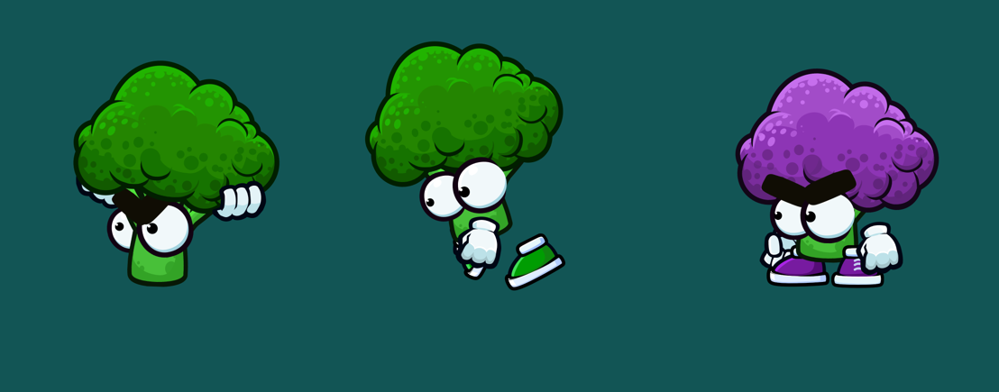

```This repo - my playground for experiments with Phaser3 Spriter Animations```. You can also find a good architecture for your game here. Architecture is still prototype, but so far it's very good in my opinion.

This repo is fully based on https://github.com/SBCGames/Spriter-Player-for-Phaser, so please star it as well :) The original repo is for Phaser2, so I've made some changes to make it work with Phaser3. My repo won't support Phaser2!

You can play with it too, but please note, that it contains one paid animation from https://www.gamedeveloperstudio.com.
I got permission to share it here, so please check their official site for more. They have a lot of cool animations for
your games.

All you probably need - is spriterPlayerLib folder. It contains files from original repo, but with some changes to make
it work with Phaser3. Please note, that I've made some changes to SpriterContainer API, so you can check original repo
for some differences. Fell free to update any files in spriterPlayerLib folder for your needs.

You can just copy-paste spriterPlayerLib in your project to make it work for you

BONUS: Please check my SpriterAnimation class. This is a wrapper for original repo, that allows you work with animations
very easy, and it contains some new features like ```playAnimationQueue```

## Here's how do I use it in my project:

1. Define ALL_ANIMATIONS const
```javascript
export const ALL_ANIMATIONS: IAnimationFile[] = [
  {
    animationName: "Broccoli",
    folderName: "broccoli",
    fileName: "broccoli"
  }
]
```

2. In your preload function:

```javascript
const store = useStore();

store.animations.preloadAllAnimations();
```

**preloadAllAnimations under the hood:**

```javascript
private preloadAnimation(animationFile: IAnimationFile) {
    const scene = useScene();

    scene.load.setPath(`./../../../animations/${animationFile.folderName}`);

    scene.load.atlas(`${animationFile.animationName}Atlas`, `${animationFile.fileName}.png`, `${animationFile.fileName}.json`);
    scene.load.xml(`${animationFile.animationName}Xml`, `${animationFile.fileName}.xml`);
}
```

3. In your create function:

```javascript
const store = useStore();

store.animations.createAllAnimations();

const plant = new GrowingPlant({
    animation: {
        x: 1500,
        y: 1500,
        width: 400,
        animationName: "Broccoli",
        defaultCharacter: "broccoli_enemy",
        defaultAnimationName: "idle"
    }
});

plant.changeCharacter("broccoli_friendly");
plant.playAnimationsQueue([
    {
        animationName: "idle",
    },
    {
        animationName: "attack",
        repeat: 2
    }
])
```
